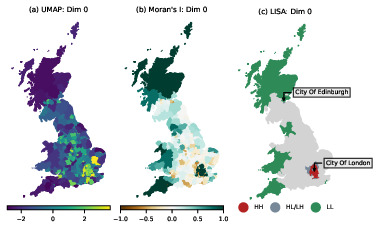

# Exploring Place from the Perspective of Informal Social Media Text

## Overview

This repository contains the [Quarto](https://quarto.org) documents used to produce my PhD thesis using the [NMFS Open Science Thesis Template](https://github.com/nmfs-opensci/quarto-thesis).

## Short Abstract

This thesis aims to explore how place-based geographic knowledge can be captured from informal social media text. The methodologies developed allow for place to be represented from a perspective not considered previously, utilising the depth of semantic information that accompanies place names embedded within informal communication. Results generated demonstrate that geographic information extracted from text does broadly conform with established geographic concepts, but with deviations that would be expected with informal place-based knowledge. The overall strength of cognitive associations between locations identified in our corpus was found to be inversely proportional to the distance between them, a distance decay effect that is commonly observed in real-world geographic environments. However, this effect was highly regional, weaker between cities where cultural associations are stronger and where perceived distance may be shorter compared with reality. Similarly, semantic information associated with locational mentions in this corpus exhibits spatial heterogeneity, but with distinct geographically cohesive clusters, particularly within Wales, Scotland and London.

## Thesis Publications

All three empirical chapters contained in this thesis have been published in peer-reviewed journals:

- **Chapter 3** - [Transformer based named entity recognition for place name extraction from unstructured text](https://doi.org/10.1080/13658816.2022.2133125) - *International Journal of Geographical Information Science*
- **Chapter 4** - [Mapping cognitive place associations within the United Kingdom through online discussion on Reddit](https://doi.org/10.1111/tran.12669) - *Transactions of the Institue of British Geographers*

- **Chapter 5** - [Mapping Great Britain's semantic footprints through a large language model analysis of Reddit comments](https://doi.org/10.1016/j.compenvurbsys.2024.102121) - *Computers, Environment and Urban Systems*

## Associated GitHub Repositories

- **Chapter 3** - [Transformer based named entity recognition for place name extraction from unstructured text](https://github.com/cjber/ger-wiki)
- **Chapter 4** - [Mapping cognitive place associations within the United Kingdom through online discussion on Reddit](https://github.com/cjber/reddit-connectivity)
- **Chapter 5** - [Mapping Great Britain's Semantic Footprints through a Large Language Model Analysis of Reddit Comments](https://github.com/cjber/reddit-footprint)
- [Reddit NER model for Place Name Identification](https://github.com/cjber/reddit-model)
